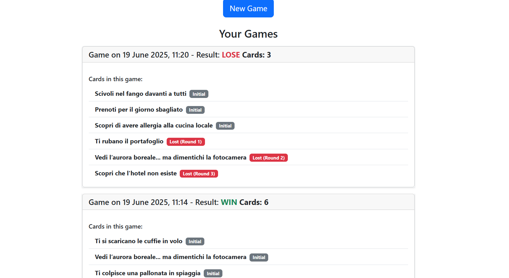
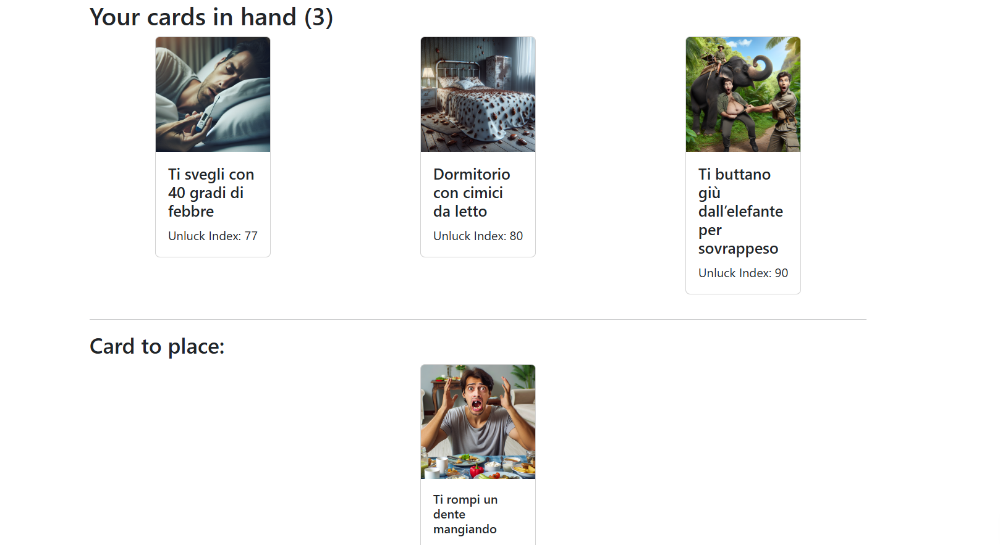

[](https://classroom.github.com/a/uNTgnFHD)
# Exam #N: "Stuff Happens"
## Student: s338561 Ferroni Alex 

## React Client Application Routes

- Route `/`: Home page. Mostra il titolo del gioco, le istruzioni su come giocare e il pulsante per provare la demo.
- Route `/login` Login page. Form di login per utenti registrati. Se già autenticato, reindirizza a /profile
- Route `/profile`User profile page.Mostra il profilo dell’utente loggato, la cronologia delle partite giocate e il pulsante per iniziare una nuova partita.
- Route `/demo` Demo game page. Permette ai visitatori di giocare una partita demo di un solo round, con 3 carte iniziali e una carta da indovinare.
- Route `/game/:gameId`: Game page.Mostra le carte attualmente in mano all’utente per la partita con id gameId e permette di iniziare un nuovo round.
- Route `/game/:gameId/round/:roundId` Round page. Mostra le carte in mano e la carta da posizionare per il round  della partita . Permette di scegliere la posizione della nuova carta e gestisce il timer.
- Route `/game/:gameId/round/:roundId/end` Round end page. Mostra il risultato del round appena concluso (vittoria, errore, timeout) e le carte aggiornate in mano.
- Route `/game/:gameId/end` Game end page. Mostra il riepilogo finale della partita: tutte le carte raccolte e il risultato (vittoria/sconfitta).
- Route `*` Not found page. Mostra un messaggio di errore per route non esistenti

## API Server

- POST `/api/something`
  - request parameters and request body content
  - response body content
- GET `/api/something`
  - request parameters
  - response body content
- POST `/api/something`
  - request parameters and request body content
  - response body content
- ...
- **POST `/api/sessions`**
  - **Request body:**  
    ```json
    { "username": "string", "password": "string" }
    ```
  - **Response body:**  
    ```json
    { "id": 1, "username": "ferrobest" }
    ```
- **GET `/api/sessions/current`**  
  - **Request parameters:** nessuno  
  - **Response body:**  
    ```json
    { "id": 1, "username": "ferrobest" }
    ```
- **DELETE `/api/sessions/current`**  
  - **Request parameters:** nessuno  
  - **Response body:**  
    ```json
    null
    ```
- **POST `/api/game/start`**  
  - **Request body:**  
    ```json
    null
    ```
  - **Response body:**  
    ```json
    { "gameId": 42 }
    ```

- **GET `/api/game/:gameId/initial-cards`**  
  - **Request parameters:** `gameId` (number)  
  - **Response body:**  
    ```json
    { "initialCards": [ { "id": 1, "name": "...", "image": "...", "index": 10 }, ... ] }
    ```
- **POST `/api/game/:gameId/round/new`**  
  - **Request parameters:** `gameId` (number)  
  - **Request body:** nessuno  
  - **Response body:**  
    ```json
    { "roundId": 5 }
    ```

- **GET `/api/game/:gameId/round/:roundId/state`**  
  - **Request parameters:** `gameId` (number), `roundId` (number)  
  - **Response body:**  
    ```json
    {
      "ownedCards": [ { "id": 1, "name": "...", "image": "...", "index": 10 }, ... ],
      "currentRound": { "card": { "id": 2, "name": "...", "image": "..." } },
      "mistakes": 1,
      "status": "in_progress"
    }
    ```

- **POST `/api/game/:gameId/round/:roundId/guess`**  
  - **Request parameters:** `gameId` (number), `roundId` (number)  
  - **Request body:**  
    ```json
    { "position": 1 }
    ```
  - **Response body:**  
    ```json
    {
      
      "ownedCards": [ { "id": 1, ... }, ... ],
      "mistakes": 0,
      "status": "in_progress",
      "lastGuessCorrect": true,
      "timeout": false
    }
    ```

- **POST `/api/game/:gameId/round/:roundId/timeout`**  
  - **Request parameters:** `gameId` (number), `roundId` (number)  
  - **Request body:** nessuno  
  - **Response body:**  
    ```json
    {
      
      "ownedCards": [ { "id": 1, ... }, ... ],
      "mistakes": 1,
      "status": "in_progress",
      "lastGuessCorrect": false,
      "timeout": true
    }
    ```

- **GET `/api/history/games`**  
  - **Request parameters:** nessuno  
  - **Response body:**  
    ```json
    [
      {
        "id": 42,
        "userId": 1,
        "status": "win",
        "date": "2025-06-17T10:00:00Z",
        "totalCards": 6,
        "totalMistakes": 1,
        "rounds_details": [
          {
            "cardName": "Lost Luggage",
            "status": "initial",
            "roundNumber": null
          }
        ]
      }
    ]
    ```

**POST `/api/demo/start`**  
  - **Request body:** nessuno  
  - **Response body:**  
    ```json
    {
      "gameId": 1,
      "roundId": 1,
      "initialCards": [ { ... }, ... ],
      "cardToGuess": { ... }
    }
    ```


- **POST `/api/demo/game/:gameId/round/:roundId/guess`**  
  - **Request parameters:** `gameId` (number), `roundId` (number)  
  - **Request body:**  
    ```json
    { "position": 2 }
    ```
  - **Response body:**  
    ```json
    {
      "correct": true,
      "timeout": false,
      "message": "You guessed right!",
      "cardToGuess": { ... }
    }
    ```

- **POST `/api/demo/game/:gameId/round/:roundId/timeout`**  
  - **Request parameters:** `gameId` (number), `roundId` (number)  
  - **Request body:** nessuno  
  - **Response body:**  
    ```json
    {
      "correct": false,
      "timeout": true,
      "message": "Time's up!"
    }
    ```

- **DELETE `/api/demo/game/:gameId`**  
  - **Request parameters:** `gameId` (number)  
  - **Request body:** nessuno  
  - **Response body:**  
    ```json
    { "result": "deleted" }
    ```
## Database Tables

### Tabella `users`

| Campo    | Tipo             | Note                              |
|----------|------------------|-----------------------------------|
| id       | INTEGER          | PRIMARY KEY, NOT NULL             |
| username | TEXT             | UNIQUE, NOT NULL                  |
| password | TEXT             | Hashed password (hex),NOT NULL    |
| salt     | TEXT             | Salt per hashing , NOT NULL       |

---

### Tabella `games`

| Campo         | Tipo     | Note                                         |
|---------------|----------|----------------------------------------------|
| id            | INTEGER  | PRIMARY KEY AUTOINCREMENT                    |
| userId        | INTEGER  | FOREIGN KEY su `users(id)`,NOT NULL          |
| status        | TEXT     | 'in_progress', 'win', 'lose', ...            |
| date          | TEXT     | Data/ora creazione partita                   |
| totalCards    | INTEGER  | Carte vinte alla fine                        |
| totalMistakes | INTEGER  | Errori totali alla fine                      |
| currentRound  | INTEGER  | Numero round giocati (o NULL)                |

---

### Tabella `rounds`

| Campo       | Tipo     | Note                                                         |
|-------------|----------|--------------------------------------------------------------|
| id          | INTEGER  | PRIMARY KEY AUTOINCREMENT                                    |
| gameID      | INTEGER  | FOREIGN KEY su `games(id)`, NOT NULL                         |
| roundNumber | INTEGER  | Numero del round (NULL per round iniziali)                   |
| cardId      | INTEGER  | FOREIGN KEY su `cards(id)`                                   |
| status      | TEXT     | 'initial', 'in_progress', 'won', 'lost', 'won_demo', 'lost_demo', 'lost_timeout_demo' |
| startedAt   | TEXT     | Data/ora inizio round (solo per round attivi)                |

---

### Tabella `cards`

| Campo   | Tipo     | Note                              |
|---------|----------|-----------------------------------|
| id      | INTEGER  | PRIMARY KEY NOT NULL              |
| name    | TEXT     | Nome della carta        NOT NULL  |
| image   | TEXT     | Path immagine                     |
| index   | REAL     | Indice di sfortuna (1-100) NOT NULL,UNIQUE       |

## Main React Components


- **HomePage** (`src/components/HomePage.jsx`):  
  Mostra il titolo del gioco, le istruzioni su come giocare e il pulsante per provare la demo.

- **LoginForm** (`src/components/AuthComponents.jsx`):  
  Form di login per utenti registrati. Gestisce l’autenticazione e la validazione delle credenziali.

- **LogoutButton** (`src/components/AuthComponents.jsx`):  
  Bottone per effettuare il logout dell’utente.

- **DefaultLayout** (`src/components/DefaultLayout.jsx`):  
  Layout principale dell’applicazione. Include la barra di navigazione, gli alert e il contenitore per le pagine.

- **NavHeader** (`src/components/NavHeader.jsx`):  
  Barra di navigazione in alto con il titolo del gioco e i pulsanti di login/logout.

- **UserProfile** (`src/components/UserProfile.jsx`):  
  Mostra il profilo dell’utente loggato, la cronologia delle partite giocate e il pulsante per iniziare una nuova partita.

- **GamePage** (`src/components/GamePage.jsx`):  
  Mostra le carte attualmente in mano all’utente per la partita selezionata e permette di iniziare un nuovo round.

- **RoundPage** (`src/components/RoundPage.jsx`):  
  Gestisce un round di gioco: mostra le carte in mano, la carta da posizionare, il timer e permette di scegliere la posizione della nuova carta.

- **RoundEndPage** (`src/components/RoundEndPage.jsx`):  
  Mostra il risultato del round appena concluso (vittoria, errore, timeout), le carte aggiornate in mano e il pulsante per passare al prossimo round o vedere il riepilogo finale.

- **GameEndPage** (`src/components/GameEndPage.jsx`):  
  Mostra il riepilogo finale della partita: tutte le carte raccolte, il risultato (vittoria/sconfitta) e i pulsanti per tornare al profilo o iniziare una nuova partita.

- **DemoPage** (`src/components/DemoPage.jsx`):  
  Permette ai visitatori di giocare una partita demo di un solo round, con 3 carte iniziali e una carta da indovinare.

- **HandCards** (`src/components/HandCards.jsx`):  
  Visualizza le carte attualmente in mano all’utente, mostrando nome, immagine e indice di sfortuna.

- **NotFound** (`src/components/NotFound.jsx`):  
  Pagina di errore visualizzata per route non esistenti.
(only _main_ components, minor ones may be skipped)

## Screenshot




## Users Credentials

- ferrobest, password (con la game history)
- andreino, password (senza game history)
